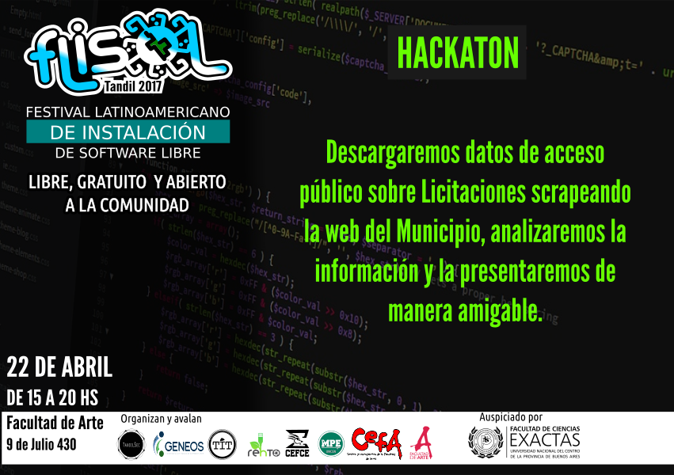

# Hackathon FliSol Tandil 2017

Cómo parte del [FliSol Tandil 2017](http://flisol.info/FLISOL2017/Argentina/Tandil),
se realizó un hackathon de datos abiertos. La temática que elegimos fue datos públicos
de licitaciones y compras realizadas por el Municipio de Tandil.

# Objetivos

Los objetivos que se plantearon durante el hackathon fueron:

* Poder extraer la información publicada por el Municipio de Tandil acerca de licitaciones
  y compras realizadas, de forma de disponerlas en un formato fácil de manipular para su 
  posterior análisis. Se decidió que contar con la información en formato `json` o
  `csv` era suficiente en una primer instancia.
  
* Analizar las relaciones entre los datos e identificar posibles visualizaciónes o agrupación
  de datos que permitan mejorar el entendimiento sobre las licitaciones y compras realizadas
  por el Municipio de Tandil.

## Fuente de datos

Partimos de la información publicada en el sitio del [Municipio de Tandil](http://www.tandil.gov.ar/), bajo la sección 
[Documentos de Interes - Compras y Suministros](http://www.autogestion.tandil.gov.ar/apex/f?p=102:13:::::CAT_DOC:41):

* [Proveedores Municipales](http://www.autogestion.tandil.gov.ar/apex/f?p=102:36::::::)
* [Licitaciones Publicas y Privadas - Pliegos](http://www.autogestion.tandil.gov.ar/apex/f?p=102:24::::::)
* [Licitaciones Publicas y Privadas - Seguimiento](http://www.autogestion.tandil.gov.ar/apex/f?p=102:27::::::)

## Scrapping

Durante el hackaton comenzamos a codear un scrapper en `python` para hacer la extracción de los
datos.

### Requerimientos

Las librerias necesarias se pueden instalar usando `pip`:

    pip install -r requirements.txt

## Análisis